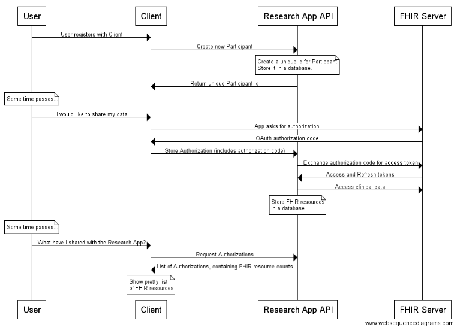

# Sync For Science Research App API

This API describes the list of endpoints available to any clients working with
the Research App API.

## Workflow

The following is the expected workflow.

## Running tests

To run the test suite, use py.test

  pip install -e . # Install "research_app" so that the tests can find it
  py.test

To see test coverage, generate a coverage report and navigate to /static/coverage/index.html.

  py.test --cov=research_app --cov-report html
